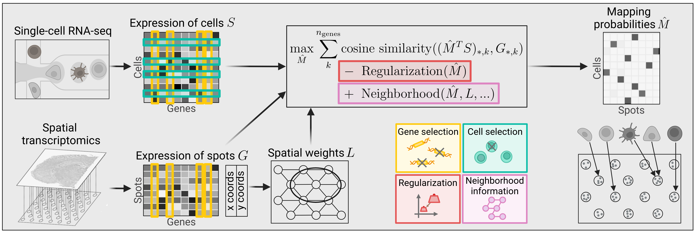

 

Tangram+ is an extension of [Tangram](https://github.com/broadinstitute/Tangram/) and based on [PyTorch](https://pytorch.org/) and [scanpy](https://scanpy.readthedocs.io/en/stable/) for mapping single-cell gene expression data onto spatial gene expression data. 

Tangram aligns single-cell and spatial data by comparing gene expression of shared genes via the cosine similarity for single-cell to spatial mapping in its default setting.
The simplicity of the model allows the incorporation of other terms to add, e.g., prior knowledge.
We refined Tangram including (orange) optimizing gene set selection, (red) employing regularization
techniques to balance consistency and certainty, (purple) incorporating spatial information using, e.g., neighborhood-based indicators, and (green) testing strategies for improved cell subset selection.



***

## Installation

* Set up conda environment using the `environment.yml` file
```
    conda env create -f environment.yml
    conda activate tangramx-env
```
* To start using Tangram+, import the code in your jupyter notebooks or/and scripts 
```
    import refined_tangram as tg
    import tangram_add_ons as tgx
```